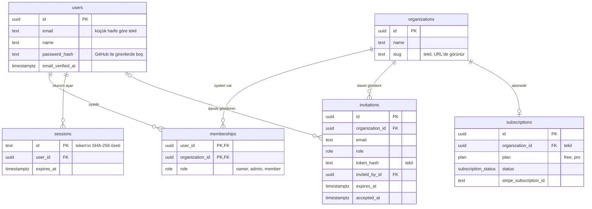

# Not 1.2: Veritabanı tasarımı

**Kod:** `src/db/schema.ts` · **Migration:** `drizzle/` · **Testler:** `src/db/schema.db.test.ts`

## Tablolar ve ilişkiler

## Tasarım kararları

**Kullanıcı ile organizasyon çoka-çok ilişkili.** Bir kişi birden fazla ekipte olabilir, bir ekipte birden fazla kişi olur. Bu ilişki `memberships` ara tablosunda durur. Rol de burada tutulur, kullanıcıda değil: Ali kendi şirketinde `owner`, danışmanlık yaptığı şirkette `member` olabilir. Veritabanı dersindeki "ilişkiye ait nitelik" tam olarak bu.

**Bileşik birincil anahtar.** `memberships` tablosunun anahtarı `(user_id, organization_id)` çifti. Bu sayede aynı kişi aynı ekibe iki kez eklenemez; kontrolü kodda yapmak yerine veritabanı garanti eder.

**Kısıtları veritabanına koymak.** "E-posta tekil olsun" kuralını sadece kodda kontrol etseydik, aynı anda gelen iki kayıt isteği ikisi de kontrolü geçip çift kayıt oluşturabilirdi (race condition). Unique index bunu imkânsız kılar. Kural: **veri bütünlüğü veritabanının işidir**, uygulama kodu sadece güzel hata mesajı gösterir.

**Büyük-küçük harf duyarsız e-posta.** `lower(email)` üzerinde unique index var. Böylece `Ali@Mail.com` ve `ali@mail.com` aynı hesap sayılır, ama kullanıcının yazdığı hali de korunur.

**Kısmi (partial) unique index.** `invitations` tablosunda "aynı kişiye aynı ekipten tek açık davet" kuralı var. Index sadece `accepted_at is null` satırları kapsar; kabul edilmiş eski davetler kurala takılmaz.

**Silme davranışları.** Kullanıcı silinince üyelikleri ve oturumları da silinir (`cascade`). Ama daveti gönderen kişi silinirse davet yaşamaya devam eder, sadece "gönderen" alanı boşalır (`set null`). Hangi verinin kime ait olduğunu bu seçimler belirler.

**Token'ların kendisi değil, özeti saklanır.** `sessions.id` ve `invitations.token_hash` alanlarında token'ın SHA-256 özeti durur. Veritabanı yedeği sızsa bile kimse bu özetten çerezi geri üretip oturum çalamaz. Bunu 1.3'te kimlik doğrulamayı yazarken kullanacağız.

**UUID birincil anahtarlar.** Sıralı sayılar (`1, 2, 3`) URL'de kaç kullanıcın olduğunu sızdırır ve tahmin edilebilir. UUID'ler tahmin edilemez.

**Abonelik organizasyona ait.** Ekip birlikte öder; bu yüzden `subscriptions.organization_id` tekil.

## Migration nedir?

Şemayı TypeScript ile `src/db/schema.ts` içinde tarif ediyoruz. `npm run db:generate` bunu önceki haliyle karşılaştırıp aradaki farkı bir SQL dosyası olarak `drizzle/` klasörüne yazar. `npm run db:migrate` henüz uygulanmamış dosyaları sırayla çalıştırır.

Böylece veritabanındaki her değişiklik Git'te kayıtlı olur. Takım arkadaşın ya da canlı sunucu aynı komutla aynı şemaya ulaşır. CI de şema değişip migration üretilmeyi unutulursa hata verir.

## Testler neyi kontrol ediyor?

`npm run test:db` gerçek bir PostgreSQL'e karşı çalışır, geliştirme veritabanına dokunmaz (`saas_test` adlı ayrı bir veritabanı kullanır). Yukarıdaki her kısıt için bir test var: tekil e-posta, çift üyelik, tek açık davet, silme davranışları ve tek abonelik.

## Düşünmen için sorular

- `memberships` tablosunda neden ayrı bir `id` sütunu yok?
- Bir organizasyonun son `owner`'ı ayrılmak isterse ne olmalı? Bu kural veritabanında mı, kodda mı durmalı?
- `sessions` tablosu zamanla büyür. Süresi dolan oturumları kim, ne zaman silmeli?
