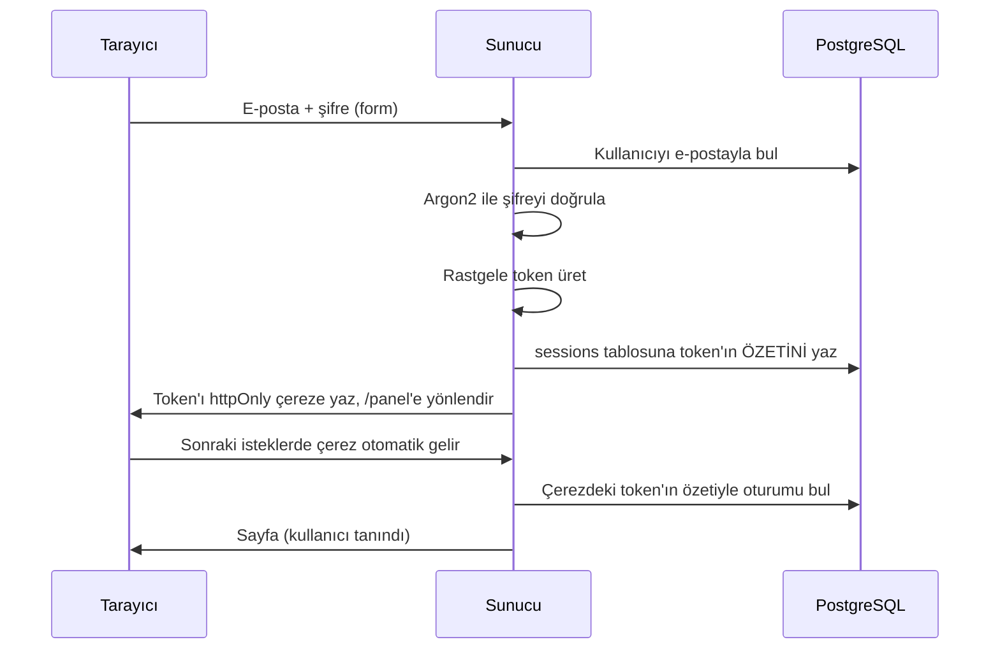

# Not 1.3: Kimlik doğrulamayı sıfırdan yazmak

**Kod:** `src/lib/auth/` · **Sayfalar:** `src/app/(auth)/`, `src/app/panel/` · **Testler:** `src/lib/auth/*.test.ts`

Hazır bir kütüphane (NextAuth, Clerk) kullanmadan kayıt, giriş, çıkış, e-posta doğrulama ve şifre sıfırlamayı yazdık. Amaç, bu kütüphanelerin içinde ne olduğunu bilmek. Mülakatlarda en çok sorulan konulardan biri bu.

## Dosyalar

| Dosya               | Görevi                                                        |
| ------------------- | ------------------------------------------------------------- |
| `password.ts`       | Şifreyi Argon2id ile özetler ve doğrular                      |
| `tokens.ts`         | Rastgele token üretir, veritabanına yazılacak özetini çıkarır |
| `session.ts`        | Oturum açar, doğrular, uzatır, kapatır                        |
| `account.ts`        | Kayıt, giriş, e-posta doğrulama, şifre sıfırlama kuralları    |
| `cookie.ts`         | Oturum çerezini güvenli ayarlarla yazar ve siler              |
| `current-user.ts`   | "Bu isteği kim yapıyor?" sorusunu cevaplar                    |
| `actions.ts`        | Formların çağırdığı server action'lar                         |
| `src/middleware.ts` | CSRF kontrolü ve çerez süresini uzatma                        |

İş kuralları (`account.ts`, `session.ts`) web'den bağımsız tutuldu: çerez, form, yönlendirme bilmiyorlar. Bu yüzden doğrudan test edilebiliyorlar. `actions.ts` sadece formu okuyup bu fonksiyonları çağırıyor.

## Giriş nasıl çalışır?

## Güvenlik kararları ve nedenleri

**Şifreler Argon2id ile özetlenir.** Argon2 bilerek yavaş ve bol bellek isteyen bir algoritma. Veritabanı çalınsa bile saldırgan her şifre tahmini için bu bedeli öder; milyarlarca deneme yapamaz. Her özete rastgele bir "salt" eklenir, bu yüzden aynı şifreyi kullanan iki kişinin özeti farklıdır.

**Oturum token'ının kendisi veritabanında yok.** Çerezde rastgele bir token durur, veritabanında onun HMAC-SHA256 özeti. Veritabanı yedeği sızsa bile özetten token geri üretilemez, kimse başkasının oturumuna giremez. HMAC'in gizli anahtarı (`SESSION_SECRET`) veritabanında değil ortam değişkeninde durur.

**Çerez ayarları.** `httpOnly`: JavaScript çereze erişemez, bir XSS açığı olsa bile token çalınamaz. `secure`: canlıda sadece HTTPS ile gönderilir. `sameSite=lax`: başka sitelerden gelen POST isteklerine çerez eklenmez.

**CSRF koruması.** Kötü bir site, ziyaretçisinin tarayıcısına bizim sitemize form gönderttirmeye çalışabilir. Middleware, veri değiştiren her isteğin `Origin` başlığının bizim alan adımız olduğunu kontrol eder; değilse 403 döner.

**Kullanıcı numaralandırmayı önlemek.** "Bu e-posta kayıtlı değil" demek, saldırgana hangi e-postaların kayıtlı olduğunu söyler. Bu yüzden:

- Girişte hep "E-posta veya şifre hatalı." deriz.
- Şifre sıfırlamada hesap olsa da olmasa da aynı mesajı gösteririz.
- Kullanıcı bulunamasa bile sahte bir Argon2 doğrulaması çalıştırırız; yoksa cevabın hızından anlaşılırdı (zamanlama saldırısı).

Kayıt sayfası "bu e-posta zaten kayıtlı" der. Bu bilinçli bir ödünleşim: kullanıcı deneyimi için kabul edilen, yaygın bir tercih.

**Kayan oturum süresi (sliding expiration).** Oturum 30 gün geçerli. Süresinin yarısından azı kalmışken kullanılırsa tekrar 30 güne uzar. Aktif kullanıcı hiç çıkış yapmak zorunda kalmaz; 30 gün uğramayanın oturumu kendiliğinden düşer.

**Tek kullanımlık linkler.** E-posta doğrulama (24 saat) ve şifre sıfırlama (1 saat) linkleri kullanılınca silinir. Kontrol ve silme tek SQL sorgusunda yapılır (`DELETE ... RETURNING`); aynı link aynı anda iki kez açılsa bile sadece biri başarılı olur. Yeni link istenince eskisi geçersiz olur.

**Şifre sıfırlanınca tüm oturumlar kapanır.** Şifresi çalındığı için sıfırlayan biri, saldırganın açık oturumunun da kapanmasını bekler.

**Race condition'a karşı veritabanı.** Kayıtta önce "bu e-posta var mı?" diye sorup sonra eklemiyoruz; aynı anda gelen iki istek ikisi de kontrolü geçebilirdi. Doğrudan eklemeyi deneyip unique kısıtının hatasını yakalıyoruz.

## Geliştirirken e-postalar

E-postalar şimdilik gönderilmiyor, `npm run dev` çalışan terminale yazılıyor (`src/lib/email.ts`). Doğrulama ve sıfırlama linklerini oradan kopyalayabilirsin. Canlıya alırken (1.7) gerçek bir e-posta servisine bağlanacak.

## Testler

- `npm test`: Şifre özetleme, token üretme ve form doğrulama (birim testleri).
- `npm run test:db`: Kayıt, giriş, oturum süresi ve uzatma, tek kullanımlık linkler, şifre sıfırlamanın oturumları kapatması (gerçek PostgreSQL ile).

## Düşünmen için sorular

- Neden JWT kullanmadık? JWT ile "bu kullanıcının tüm oturumlarını kapat" nasıl yapılırdı?
- Bir saldırgan aynı hesaba saniyede bin şifre denerse ne olur? (İpucu: rate limiting, proje 2'de.)
- `sameSite=strict` olsaydı, e-postadaki bir linke tıklayıp siteye gelen kullanıcı ne yaşardı?
