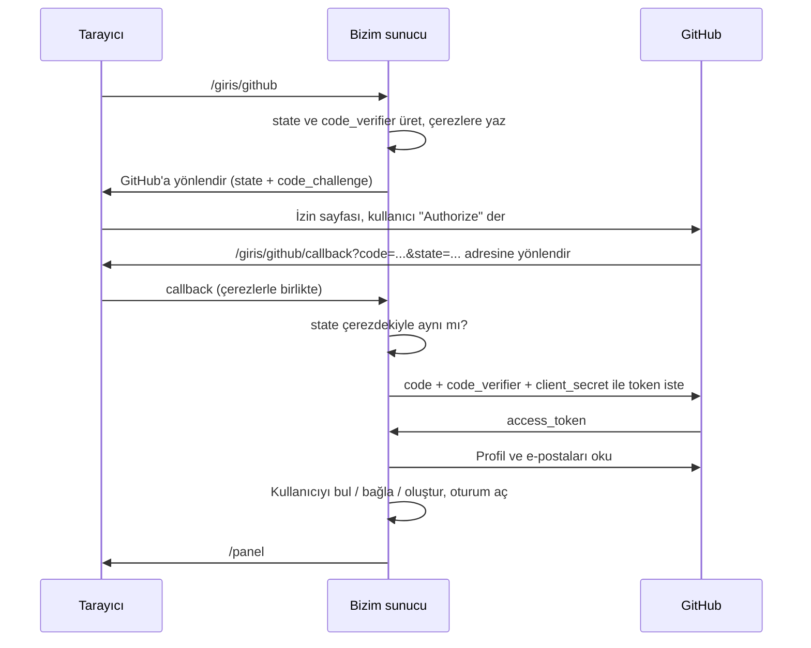

# Not 1.3b: GitHub ile giriş (OAuth 2.0)

**Kod:** `src/lib/auth/github.ts`, `src/lib/auth/oauth.ts`, `src/app/(auth)/giris/github/` · **Hesap eşleme:** `loginWithOAuth` (`src/lib/auth/account.ts`)

## Bilgisayarında açmak için

1. GitHub'da **Settings → Developer settings → OAuth Apps → New OAuth App** sayfasını aç ([kısayol](https://github.com/settings/applications/new)).
2. Şunları gir:
   - **Application name:** `saas-s (yerel)`
   - **Homepage URL:** `http://localhost:3000`
   - **Authorization callback URL:** `http://localhost:3000/giris/github/callback`
3. **Register application** de. Açılan sayfadaki **Client ID** değerini kopyala, sonra **Generate a new client secret** ile bir secret üret ve onu da kopyala.
4. `.env` dosyana ekle:
   ```
   GITHUB_CLIENT_ID=buraya-client-id
   GITHUB_CLIENT_SECRET=buraya-client-secret
   ```
5. `npm run db:migrate` ve `npm run dev` çalıştır. Giriş sayfasında "GitHub ile giriş yap" butonu görünür.

Client secret bir şifredir: `.env` dosyası Git'e girmez, onu kimseyle paylaşma.

## Akış



## Öne çıkan kararlar

**state parametresi (CSRF'e karşı).** Giriş başlarken rastgele bir değer üretip hem çereze yazıyor hem GitHub'a gönderiyoruz. Dönüşte ikisi eşleşmezse istek bizim başlattığımız bir giriş değildir. Bu olmasaydı, saldırgan kendi GitHub hesabının callback linkini kurbana tıklatıp kurbanı saldırganın hesabına sokabilirdi.

**PKCE.** GitHub'a gizli `code_verifier` yerine onun SHA-256 özetini (`code_challenge`) gönderiyoruz. Kodu token'a çevirirken verifier'ın kendisini yolluyoruz. Dönüş URL'sindeki `code` bir şekilde çalınsa bile verifier olmadan işe yaramaz. Önceden sadece mobil uygulamalar için önerilirdi; artık OAuth 2.1 her istemciye öneriyor.

**Client secret sadece sunucuda.** Token alma isteğini tarayıcı değil sunucumuz yapıyor; secret hiçbir zaman tarayıcıya gitmiyor.

**En az yetki.** Sadece `read:user` ve `user:email` izinlerini istiyoruz. Repolarına erişim istemiyoruz; istemediğimiz yetkiyi taşımak risktir.

**Kullanıcıyı GitHub numarasıyla tanımak.** GitHub kullanıcı adı ve e-posta değişebilir, hesap numarası değişmez. `oauth_accounts` tablosunda bu numarayı saklıyoruz.

**Hesap bağlama.** GitHub ile gelen kişinin e-postasıyla zaten bir hesap varsa, GitHub hesabını ona bağlıyoruz; kişi hem şifresiyle hem GitHub ile aynı hesaba girebiliyor. Bunu **sadece GitHub e-postayı doğrulamışsa** yapıyoruz. Doğrulanmamış bir e-postaya güvenseydik, biri GitHub hesabına başkasının adresini ekleyip o kişinin hesabına girebilirdi. Bu, gerçek ürünlerde yaşanmış bir açık türü ("pre-account takeover").

**Şifresiz kullanıcılar.** Sadece GitHub ile kayıt olanların `password_hash` alanı boş. İsterlerse "Şifremi unuttum" ile bir şifre belirleyebilirler.

## Testler

- `npm test`: PKCE'nin RFC 7636'daki örnek değerle aynı sonucu verdiği, doğrulanmamış e-postanın reddedildiği.
- `npm run test:db`: Yeni kullanıcı oluşturma, ikinci girişte aynı kullanıcıyı bulma, mevcut hesaba bağlama, doğrulanmamış e-postayı reddetme, ikinci bir GitHub hesabının bağlanmasını engelleme.

## Düşünmen için sorular

- state'i çerez yerine veritabanında tutsaydık ne değişirdi?
- Kullanıcı panelden GitHub bağlantısını kaldırmak isterse, hiç şifresi yoksa ne olmalı?
