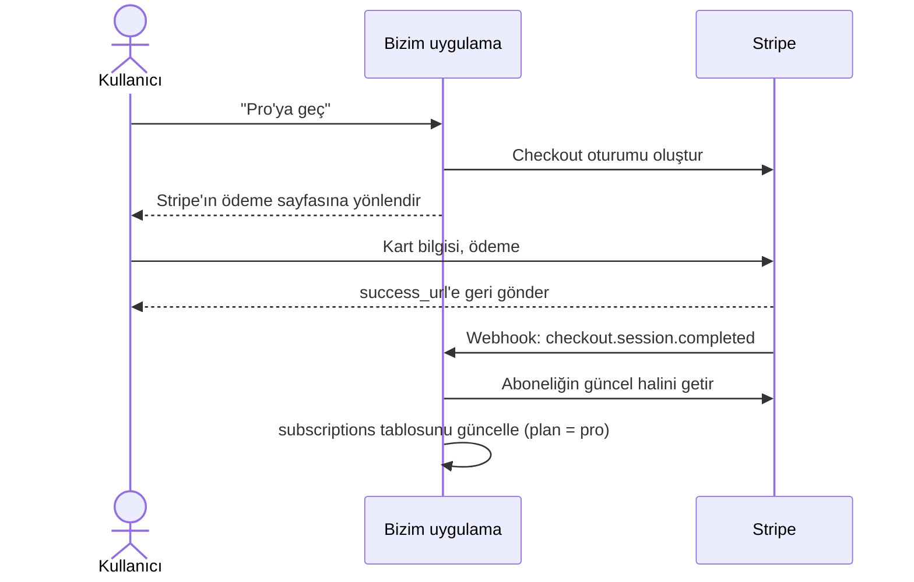

# 1.5 Abonelik ve ödeme (Stripe)

Bu adımda ekiplere iki plan ekledik: **Ücretsiz** (en fazla 5 kişi) ve
**Pro** (en fazla 50 kişi). Pro'ya geçiş Stripe ile, test modunda, gerçek para
çekmeden yapılıyor.

## Büyük resim



Üç önemli fikir:

1. **Kart bilgisi bize hiç gelmez.** Ödeme sayfası Stripe'ın (Checkout). Kartı
   değiştirme, fatura indirme, iptal de Stripe'ın sayfasında (Customer Portal).
   Kart verisine dokunmadığımız için PCI uyumluluğu gibi ağır yükler bizde değil.
2. **Planı webhook değiştirir, dönüş sayfası değil.** Kullanıcı ödemeden sonra
   `?odeme=basarili` adresine döner ama o adresi herkes elle açabilir. Planı
   sadece Stripe'ın imzalı webhook'u Pro yapar.
3. **Doğru bilginin sahibi Stripe'tır.** Bizim `subscriptions` tablomuz onun bir
   kopyası. Kopyayı güncel tutmak için her olayda aboneliğin Stripe'taki en
   güncel halini çekiyoruz.

## Dosyalar

| Dosya                                 | Ne yapar                                              |
| ------------------------------------- | ----------------------------------------------------- |
| `src/lib/billing/signature.ts`        | Webhook imzasını doğrular (HMAC-SHA256, 5 dk sınır)   |
| `src/lib/billing/plans.ts`            | Plan sınırları, durum → plan kuralı, Türkçe etiketler |
| `src/lib/billing/service.ts`          | Aboneliği tabloya yazma, olayı bir kez işleme         |
| `src/lib/billing/stripe.ts`           | Stripe istemcisi (env yoksa `null`)                   |
| `src/lib/billing/actions.ts`          | "Pro'ya geç" ve "Aboneliği yönet" butonları           |
| `src/app/api/stripe/webhook/route.ts` | Stripe'ın olay gönderdiği adres                       |
| `src/app/org/[slug]/faturalandirma/`  | Faturalandırma sayfası (sadece sahip görür)           |

## Webhook'ta dikkat ettiğimiz üç şey

**1. Sahte istekler.** Webhook adresi internete açık. Stripe her isteği
`whsec_...` secret'ı ile imzalar; imza tutmazsa 400 döneriz. İmza ham gövde
üzerinden hesaplandığı için gövdeyi `request.text()` ile okuyoruz, JSON'a
çevirip geri çevirmiyoruz.

**2. Aynı olay iki kez gelebilir.** Stripe cevabımızı alamazsa tekrar gönderir.
Her olayın id'sini `stripe_events` tablosuna yazıyoruz; ikinci geliş primary
key'e takılıp atlanıyor. Bu kayıt, abonelik güncellemesiyle **aynı
transaction** içinde. Güncelleme yarıda hata verirse ikisi birden geri alınır,
Stripe tekrar denediğinde olay baştan işlenir.

**3. Olaylar sırasız gelebilir.** "updated" olayı "created"tan önce gelebilir.
Olayın içindeki o anki veriye güvenmek yerine aboneliği Stripe'tan yeniden
çekiyoruz (`subscriptions.retrieve`). Hangi sırayla gelirse gelsin son durum
doğru olur.

Middleware'deki CSRF (Origin) kontrolünden webhook adresini muaf tuttuk: onu
tarayıcı değil Stripe'ın sunucusu çağırıyor, kendi imza kontrolü var.

## Durum → plan

Stripe aboneliğin durumunu söyler, biz ona göre planı belirleriz
(`planForStatus`):

| Stripe durumu                                 | Plan     | Neden                                                      |
| --------------------------------------------- | -------- | ---------------------------------------------------------- |
| `active`, `trialing`                          | Pro      | Ödenmiş ya da denemede                                     |
| `past_due`                                    | Pro      | Kart reddedildi, Stripe tekrar deniyor. Hemen düşürmüyoruz |
| `canceled`, `unpaid`, `incomplete*`, `paused` | Ücretsiz | Ödeme yok                                                  |

Portaldan iptal edilen abonelik dönem sonuna kadar `active` kalır
(`cancel_at_period_end = true`). Sayfa "Bitiş: 8 Kasım" der; o gün Stripe
`customer.subscription.deleted` gönderir ve ekip Ücretsiz'e döner.

## Plan sınırı

`createInvitation` artık **üyeler + bekleyen davetler** sayısına bakıyor.
Ücretsiz planda 5'e ulaşınca yeni davet "Planının üye sınırına ulaştın" hatası
verir. Bekleyen davetleri de saymamızın nedeni: saymasaydık 100 davet atıp hepsi
kabul edildiğinde sınır aşılırdı.

## Kendi bilgisayarında denemek (Windows)

### 1. Stripe hesabı ve anahtarlar

1. <https://dashboard.stripe.com/register> adresinden ücretsiz hesap aç. Şirket
   bilgisi girmene gerek yok; test modu hemen çalışır.
2. Sağ üstte **Test mode** açık olsun.
3. **Developers → API keys** sayfasından **Secret key**'i (`sk_test_...`)
   kopyala → `.env` içinde `STRIPE_SECRET_KEY`.

### 2. Pro planının fiyatı

1. **Product catalog → Add product**.
2. Ad: `Pro`. Fiyat: örneğin `9 USD`, **Recurring**, **Monthly**. Kaydet.
3. Ürün sayfasında fiyatın id'sini (`price_...`) kopyala → `STRIPE_PRICE_PRO`.

### 3. Müşteri portalını bir kez kaydet

**Settings → Billing → Customer portal** sayfasını aç ve **Save** de. Kaydedilmemiş
portal ile "Aboneliği yönet" butonu hata verir. "Cancel subscriptions" açık
olsun, iptal zamanı "At end of billing period" seçili kalsın.

### 4. Webhook'ları bilgisayarına yönlendir (Stripe CLI)

Stripe, `localhost`'a doğrudan ulaşamaz. Stripe CLI olayları senin
bilgisayarına aktarır.

1. Kur: <https://github.com/stripe/stripe-cli/releases/latest> adresinden
   `stripe_X.Y.Z_windows_x86_64.zip`'i indir, içindeki `stripe.exe`'yi bir
   klasöre koy (ya da `scoop install stripe`).
2. `stripe login` (tarayıcıda onayla).
3. Uygulama çalışırken ikinci bir terminalde:

   ```bash
   stripe listen --forward-to localhost:3000/api/stripe/webhook
   ```

4. Ekrana yazdığı `whsec_...` değerini `STRIPE_WEBHOOK_SECRET` olarak `.env`'e
   koy ve `npm run dev`'i yeniden başlat. (Bu secret `stripe listen`'e özel;
   canlıda Dashboard'dan ayrı bir tane alacağız, 1.7'de.)

### 5. Dene

1. `npm run db:migrate` (yeni tablo için), sonra `npm run dev`.
2. Bir ekip aç → **Faturalandırma** → **Pro'ya geç**.
3. Test kartı: `4242 4242 4242 4242`, ileri bir tarih (12/34), herhangi bir CVC,
   herhangi bir posta kodu.
4. Geri dönünce `stripe listen` terminalinde olayların `200` ile işlendiğini
   göreceksin; sayfayı yenile, plan **Pro**.
5. **Aboneliği yönet** → iptal et → sayfa "Bitiş" tarihini gösterir.

Başka test kartları: `4000 0000 0000 9995` (yetersiz bakiye, reddedilir),
`4000 0025 0000 3155` (3D Secure ister).

## Testler

- `signature.test.ts`: Stripe SDK'sının ürettiği imzayla uyum, değiştirilmiş
  gövde, yanlış secret, eski zaman damgası, bozuk başlık.
- `plans.test.ts`: her durumun doğru plana gitmesi.
- `billing.db.test.ts`: senkronizasyon, aynı olayın iki kez işlenmemesi, hata
  olunca geri alma, eski aboneliğin yeni aboneliği bozmaması. Stripe'a gitmemek
  için `retrieve` fonksiyonunu sahtesiyle değiştiriyoruz.
- `org.db.test.ts`: plan sınırı.
